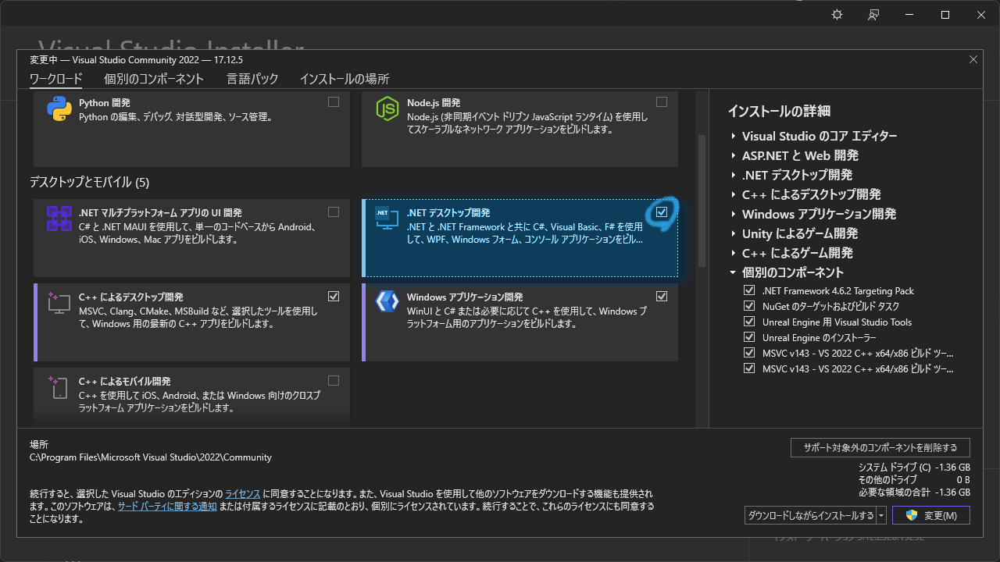
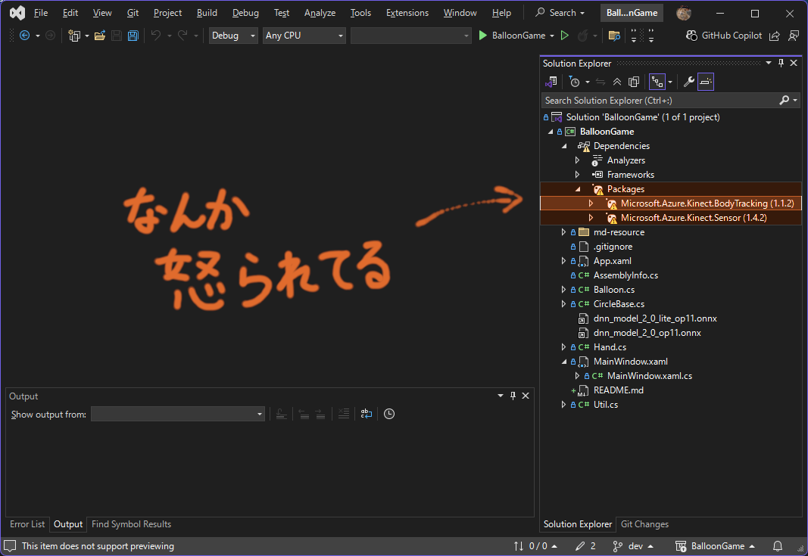
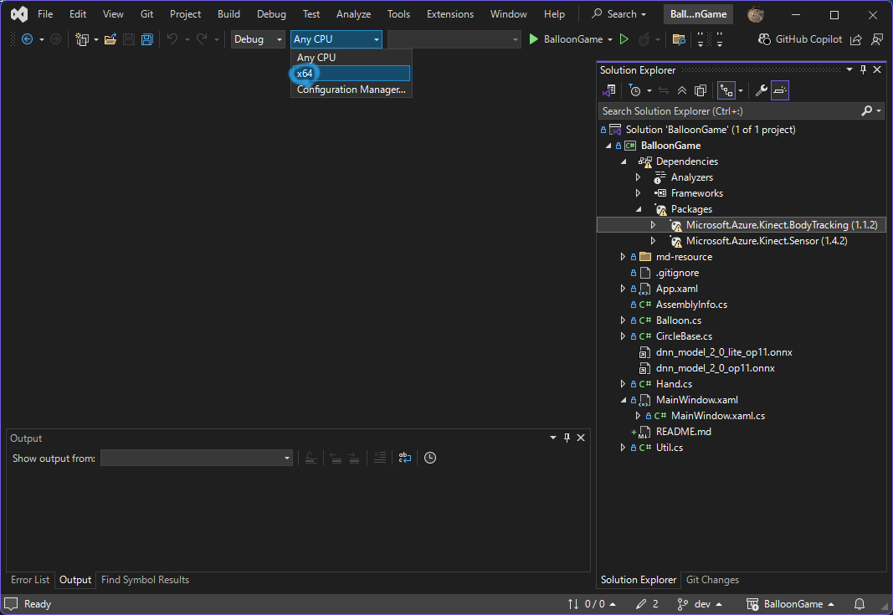
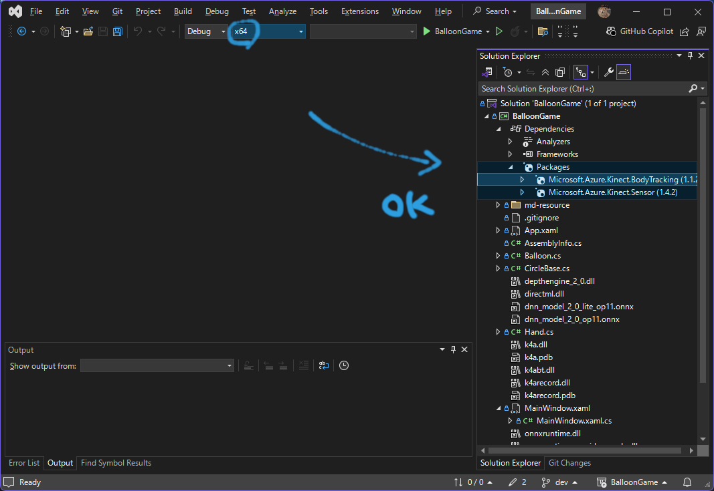

# C# WPF Project

## 風船ゲーム on C# WPF
version 🛠️ snapshot-20250219

開発環境:
* [Visual Studio Community 2022](https://visualstudio.microsoft.com/ja/vs/)
  * C# 12.0
  * .NET 8.0
  * WPF + .NET Framework 4.8

### 環境セットアップ
すでに Visual Studio（Code じゃないよ！）を使えるならこの手順はスキップ可能

1. Visual Studio 2022 を準備，Community（無料）でも Pro（ **有料** ）でも Enterprise（ **有料** ）でも OK

   https://visualstudio.microsoft.com/ja/vs/

1. C# WPF 開発環境をインストール

   「.NET デスクトップ開発」にチェックを入れてインストール，この画面は「変更」ボタンだけど初回インストールなら「インストール」ボタン

   

1. インストール待ち ☕

   ちょっと長いので休憩

1. 完了したら [BalloonGame.sln](./BalloonGame.sln) を開く

### ビルド + 実行
ソリューション（sln ファイル）を開くと NuGet パッケージマネージャの警告が出てビルドできないので解消する

1. プラットフォームを x64 のみにする

   

1. ⚠️ マークが消える

   

1. ビルドができる，ショートカットキーは <kbd>Ctrl</kbd> + <kbd>Shift</kbd> + <kbd>B</kbd>

1. Kinect をつないでなくてもとりあえずマウスで遊べる，ショートカットキーは <kbd>F5</kbd>

* 32 ビットマシンだと起動できないので注意

### ソースコード
同じ階層に全部あるよ

* [App.xaml](./App.xaml)，[App.xaml.cs](./App.xaml.cs)

  WPF アプリとして振る舞うやつ（あんまり関係ない）

* [MainWindow.xaml](./MainWindow.xaml)，[MainWindow.xaml.cs](./MainWindow.xaml.cs)

  メインのウィンドウに表示するマークアップ（XAML 形式）とロジック（C#）が全部入ってる

  * ビジー状態にならない程度に Kinect と通信する
  * ビジー状態にならない程度にアニメーションを始める
    * 風船をランダムにスポーンさせる
    * すべての風船に対して衝突判定を実行して，ぶつかったら衝突フラグをセットする
    * すべての風船に対して場外判定を実行して，場外に飛んでいったら消滅フラグをセットする
    * 消滅フラグを持っている風船を削除する
    * 風船をすべて描画
    * マウス位置を手として描画
    * 手をすべて描画
  * マウスの操作を受け付ける
  * ウィンドウのサイズ変更を追いかける

* [CircleBase.cs](./CircleBase.cs)

  円を描画する抽象クラス

  * 座標（`X`，`Y`），`大きさ` の情報を持っている
  * 実際に自分自身を描画できる
  * 他の円との衝突判定ができる，風船同士の衝突も判定できる

* [Balloon.cs](./Balloon.cs)

  風船を表現するクラス，CircleBase を継承

  * 自分自身の位置座標を更新できる，もしぶつかったら上に向かっていく
  * 衝突フラグを持っている
  * 消滅フラグを持っている

* [Hand.cs](./Hand.cs)

  手を表現するクラス，CircleBase を継承

  * （`X`，`Y` 地点に `大きさ` の円を描画するだけなので特記事項無し）

* [Util.cs](./Util.cs)

  C# のかゆいところに手が届かない部分を自前でコーディングしたもの

  * `class MathHelper`
    * `float Lerp(float, float, float)`

      アニメーションをするときに必ずと言っていいほど使う Linear Interpolation

  * `class TimeUtils`
    * `long CurrentTimeMillis()`

      Java で標準サポートされてる UNIX Time（`System.currentTimeMillis()`）が C# で使える

### つぎにやること

* Kinect で実際に動かしてみて座標の位置合わせ
  * 出てくる手の円の位置がもうちょっと上のほうがいいとか
  * 体をけっこう動かさないと，自分が思った位置まで動かないから感度良くしてほしいとか
  * 右手動かしてるはずなのに画面の中で反対の円が動いてるとか
    * （カメラ画像は基本ミラーされるので当然だけど直感的ではない）
* プレイヤー 2 人以上に対応
  * 現状手の丸が全部オレンジなのできっとわかりにくい
* Azure Kinect で動作確認
* Orbbec Femto Bolt で動作確認
* （おまけ）Kinect v2 で動作確認
